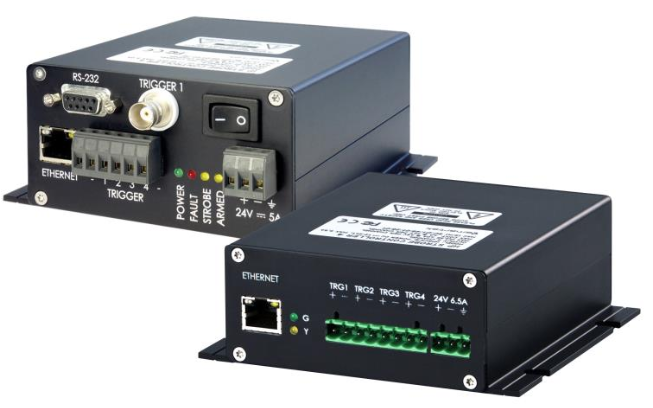

# Strobe Controller Communication

Developed code to enable effective communication with [FRAMOS](https://www.framos.com/en/product-catalog/strobe-controllers) strobe controllers using raw commands. The code simplifies the configuration of network settings and user-defined parameters.

## Folders to Use

### StrobeRaw_NetworkP

This code is designed for reading and writing network parameters on a strobe controller (IPSC or HPSC). To use this code:
1. Update the IP addresses of both the computer and the strobe.
2. Write the desired command.
3. Utilize the `SendPacket` function to send it.

### StrobeRaw_UserP

This code is designed for reading and writing user parameters on a strobe controller (IPSC or HPSC). To use this code:
1. Update the IP address with the appropriate IP address of your strobe controller.
2. Write the desired command.
3. Use the functions `sendPacketIPSC` or `sendPacketHPSC` to send it.

### Crc-16

In the `crc-16` folder, you can run the code where you only need to add your payload. It will generate the correct codes to introduce in your raw command.

## About

### Brief explanation of strobe controllers:
Strobe controllers are devices used to manage and synchronize the flashing of lights in machine vision systems. They ensure precise timing and intensity of strobe lights, enhancing image quality and capturing clear images of fast-moving objects.

  
   
  <em>Fig. 1 - Reference image of the strobes</em>

